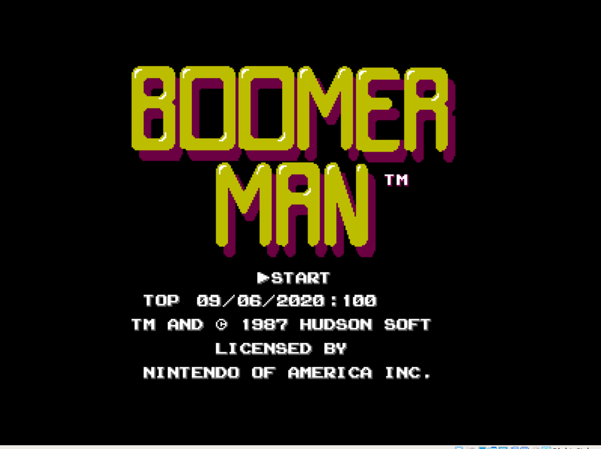
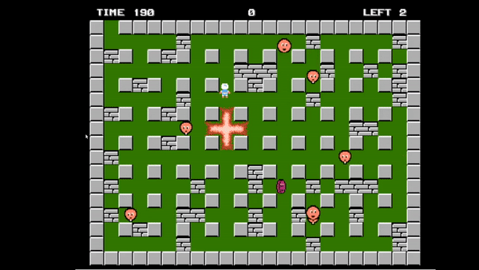

# BoomerMan

- **Project name:** BoomerMan
- **Short description:** Clone of the 1983 NES classic **Bomberman**.
- **Institution:** [FEUP](https://sigarra.up.pt/feup/en/web_page.Inicial)
- **Course:** [LCOM](https://sigarra.up.pt/feup/en/ucurr_geral.ficha_uc_view?pv_ocorrencia_id=436435) (Computer Laboratory)
- **Project grade:** 17/20
- **Group members:**
    - [João António Cardoso Vieira e Basto de Sousa](https://github.com/JoaoASousa) ([up201806613@fe.up.pt](up201806613@fe.up.pt))
    - [Rafael Soares Ribeiro](https://github.com/up201806330) ([up201806330@fe.up.pt](mailto:up201806330@fe.up.pt))

## Instalation
This game runs on a MINIX environment provided by the the faculty ([here](https://drive.google.com/file/d/1fr53rXFJPd6oopmLKT6f6j77bqqiEWKh/view)). Simply install the image on a virtual machine software and navigate to the project source file to compile and run.

## Make commands
### Compile

```sh
make
```

### Cleanup

```sh
make clean
```

## Run

```sh
lcom_run proj
```

## Gameplay
Like the original, the game consists of progressing through various levels, killing enemies by placing bombs in their path and collecting various powerups.



The player can move using the **WASD keys** or the **mouse pointer**, and place bombs with the **spacebar** or **left mouse click**.



